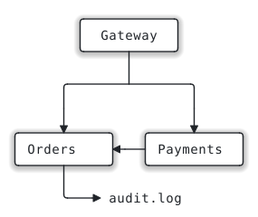
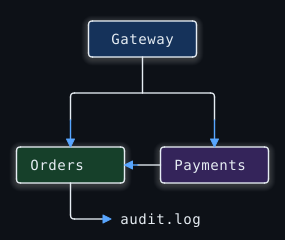
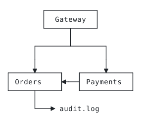

# ascii2svg

**Your text diagrams, drawn properly. Every character stays exactly where you put it.**

<p align="center">
  
</p>

You sketch a diagram in plain text, in a README, a code comment, a chat with an AI, or a
notes app. It looks right in a monospace font and falls apart everywhere else: Slack,
email, Confluence, slides, a phone.

`ascii2svg` turns it into a crisp SVG that draws itself, follows your reader's light or dark
mode, and shows data moving along the arrows. It is still **1:1**: every run reads its
own SVG back and checks it against your text, cell by cell. If anything moved, it tells you.

## Type this…

```
+------------+     +------------+     +------------+     +-------------+
|    Idea    |---->|   Draft    |---->|   Review   |---->|   Publish   |
+------------+     +------------+     +-----+------+     +-------------+
                         ^                  |
                         |                  |
                         +------------------+
                           needs changes
```

## …get this

<p align="center"></p>

```bash
python3 scripts/ascii2svg.py workflow.txt -o workflow.svg --color --theme auto --animate
```

Plain `+ - |` became real lines, `v ^ < >` became arrowheads, and the words stayed words.
It works just as well with Unicode box characters (`┌─┐ │ └─┘ ╭╮ ═║ ▶`).

## Who it's for

**If you don't write code:** ask Claude. With this repo installed as a skill, say
*"turn this diagram into an image for my slides"* or *"make this look nice for our wiki"*,
and it picks the options for where the diagram is going, checks the result, and hands you the file.
Nothing to learn.

**If you do:** it's one Python file with no dependencies. It reads a file, stdin, or `--text`, and
writes an SVG plus a JSON report that an agent or a CI job can check (`exit_code`, `roundtrip`, `warnings`).
It never guesses: a character it isn't sure about stays text.

## Pick a look

Same diagram, same guarantee, five ways:

| Default | Colour | Dark | Print | Alive |
|:-:|:-:|:-:|:-:|:-:|
|  |  |  |  |  |
| *(no options)* | `--color` | `--theme dark`<br>`--color` | `--style flat`<br>`--square` | `--animate`<br>`--color`<br>`--theme auto` |

| Option | What it does |
|---|---|
| `--color` | Soft tints grouped by what contains what: each top-level group gets its own hue, nested boxes keep it. Arrows turn accent blue. |
| `--theme light\|dark\|auto` | `auto` follows the reader's system light/dark setting, which suits GitHub READMEs and docs sites. |
| `--animate draw` | The diagram draws itself once, top to bottom: lines are sketched in accent blue and settle to ink, boxes fade in, arrowheads pop. |
| `--animate flow` (or bare `--animate`) | `draw`, then glowing pulses keep travelling along every connector toward its arrowhead, so readers can see where things go. |
| `--animate scroll` | For tall diagrams, as a web page: each part appears as the reader scrolls to it, and long connectors grow downward with the scroll. See below. |
| `-o page.html` (or `--html`) | A standalone web page with the diagram inline. Double-click to open, or email it. |
| `--style glow\|shadow\|flat` | Depth under the boxes. The glow shrinks automatically so it never sits behind a label. |
| `--square` | Keep corners square (they are rounded by default). |

The animation is careful about where it runs:

- **It never changes what's drawn.** An animated file is the static file plus timing. When
  the animation ends, you're looking at exactly what the self-check verified. Tools that
  don't play animation (PNG export, most editors) show the finished drawing.
- **It respects the reader.** With *reduce motion* turned on in the OS, nothing moves.
- **`draw` and `flow` need no JavaScript.** They use CSS and SVG `<animate>` only, so they play
  inside a plain `` tag, which is how GitHub, Notion and most docs sites show images.
- **Hover a box** in a browser and it lights up. That helps when you're presenting.

## Tall diagrams: reveal as you scroll

A 70-row architecture diagram drawn on a timer finishes before anyone scrolls down to it.
With `--animate scroll`, the diagram unfolds with the reader instead:

```bash
python3 scripts/ascii2svg.py architecture.txt -o architecture.html --color --theme auto --animate scroll
```

- Boxes and labels fade in as they reach the lower edge of the screen.
- Long vertical connectors are drawn *by the scroll*: they grow downward in accent blue as you
  read, then settle to ink.
- Each flow pulse starts once its whole route is on screen.
- With *reduce motion* on, the page shows the finished diagram.

**Why a web page, not just an SVG?** An SVG shown as an image (which is how GitHub READMEs,
Notion and most docs sites show them) can't see the page it sits in, so it can't know how
far you've scrolled. CSS scroll timelines don't drive SVG shapes either: we tested it, and
Chromium leaves them inactive. So `scroll` writes an `.html` page with the SVG inline and about
2 KB of plain JavaScript (IntersectionObserver and CSS animations, no libraries). It uses only
standard browser features and works offline, though so far it has been tested in Chromium only. `--animate scroll` with a plain `.svg` output
is refused with an explanation. The SVG inside the page is the same self-checked drawing; the
script only decides *when* each part appears.

Try it: download [`docs/architecture.html`](docs/architecture.html) and open it. GitHub shows
`.html` files as source, not as pages.

## Where is it going?

| Destination | Use |
|---|---|
| GitHub README, docs site | `--theme auto --color --animate`, then commit the `.svg` |
| A tall diagram people will scroll through, or a page to share | `-o diagram.html --color --theme auto --animate scroll` |
| Slides (Keynote, Google Slides, PowerPoint) | `--color --animate draw` for a live build. For a still, `--color --png` |
| Slack, email, Jira, anywhere SVG isn't shown | `--color --png` (needs `pip install cairosvg`). PNGs are always the finished frame |
| Printed docs, a PDF | `--style flat --square` |
| Dark-mode apps | `--theme dark --color` |

## A bigger one

The flows follow the real wiring: through junctions, down to both branches of a fan-out, and
across the edge of a container.

<p align="center"></p>

<details><summary>The text it came from (72 × 96 characters)</summary>

See [`tests/fixtures/complex_unicode.txt`](tests/fixtures/complex_unicode.txt). 28 boxes, 18 arrows, a
call tree and double-line borders, all drawn from plain text.

</details>

## Install

Python 3.8+ and nothing else. Copy `scripts/ascii2svg.py` anywhere, or:

```bash
pip install .                # adds the `ascii2svg` command
pip install ".[width,png]"   # optional: wcwidth (character widths) + cairosvg (--png)
```

**As a Claude skill:** build the package, then install it:

```bash
python3 tools/package_skill.py        # -> dist/ascii2svg.skill (19 KB: SKILL.md + the script)
```

- **claude.ai / Claude desktop:** Customize → Skills → upload `ascii2svg.skill`.
- **Claude Code:** unzip it into `~/.claude/skills/` (you get `~/.claude/skills/ascii2svg/`).

[`SKILL.md`](SKILL.md) tells Claude when to use it, which look fits which destination (including
`scroll` pages for tall diagrams), and how to read the report before handing you the file.

## Usage

```
ascii2svg [INPUT] [-o OUT.svg|OUT.html] [--html] [--json] [--color] [--theme light|dark|auto]
          [--animate [draw|flow|scroll]] [--style glow|shadow|flat] [--square]
          [--png [PATH]] [--strict] [--text TEXT] [--tab-size N] [--title TEXT]
```

| Input | How |
|---|---|
| File | `ascii2svg diagram.txt -o out.svg` |
| stdin | `cat diagram.txt \| ascii2svg > out.svg` |
| Inline | `ascii2svg --text "$DIAGRAM" --json` (the SVG comes back inside the JSON when there's no `-o`) |
| Markdown | The first ```` ``` ```` code block is used. Prose around it is dropped (and reported) |

stdout is always exactly one thing: the SVG (or the page, with `--html`), or (with `--json`) the report. A one-line
summary goes to stderr.

## What gets drawn

| Source | Drawn as lines when… | Otherwise |
|---|---|---|
| `─│┌┐└┘├┤┬┴┼╭╮╰╯═║╔╗╚╝╪`, `▼▲▶◀` | always | – |
| ASCII `+` `-` `\|` | they form a closed box, or attach to one directly or through `+` junctions | stay text |
| ASCII `v ^ < >` | they end a line that is drawn, or point at a box (touching, or one space away) | stay text |

When unsure, a character stays text, so the worst case is the character itself in its own cell,
never a wrong shape. `a->b`, `--dry-run`, `user_id`, `C:\temp`, markdown tables and `|--` file
trees all stay exactly as written.

## How 1:1 is guaranteed

Every run parses the SVG it just wrote (lines, curves, arrowheads, text positions) back into a
character grid and compares it with the input, cell by cell. ASCII characters may only appear as
the line they stand for (`-`→`─`, `|`→`│`, `+`→corner or junction, `v`→`▼`). Any mismatch is
exit code 2. This covers every look, including animated ones and the still frame used for PNGs.

## JSON report

| Field | Meaning |
|---|---|
| `ok`, `exit_code` | Overall result (see exit codes) |
| `roundtrip` | `exact`: the SVG was read back and matches the input cell for cell |
| `rows`, `cols`, `boxes`, `arrowheads`, `text_cells` | What was found |
| `flows` | Connectors animated with `--animate flow` (one per arrowhead route) |
| `style`, `theme`, `color`, `animate` | The look that was rendered |
| `ascii_drawn_as_lines` | ASCII characters drawn as lines |
| `ascii_line_like_kept_as_text` | ASCII `- \| +` not drawn because they don't attach to anything |
| `normalized` | Every clean-up applied (tabs, odd spaces, zero-width and control characters, colour codes, code fence, indentation, bad UTF-8) |
| `warnings` | Line ends that meet nothing, with 1-based `row`/`col`. Usually a misaligned source |
| `tips` | Suggestions, e.g. "tall diagram: use `--animate scroll`" when a timed animation would finish off-screen |
| `svg` / `html`, `png` | Output paths (or the markup itself when no `-o` is given) |
| `self_check_problems` | Only when `roundtrip` isn't exact |

## Exit codes

| Code | Meaning |
|---|---|
| 0 | OK (warnings allowed) |
| 1 | Bad input or usage (message in `error`) |
| 2 | Self-check failed: the SVG is not 1:1. Don't use it |
| 3 | `--strict` and there were warnings |

## Using it from any agent framework

Expose it as one tool and run the CLI in the handler:

```json
{
  "name": "render_ascii_diagram",
  "description": "Render an ASCII/Unicode box diagram to an SVG file, keeping every character in place. Returns a JSON report; exit_code 0 means success.",
  "input_schema": {
    "type": "object",
    "properties": {
      "diagram": {"type": "string", "description": "The diagram text (a markdown code block is fine)"},
      "output_path": {"type": "string", "description": "Where to write the .svg"},
      "color": {"type": "boolean", "description": "Tint boxes by group and colour the arrows"},
      "theme": {"type": "string", "enum": ["light", "dark", "auto"]},
      "animate": {"type": "string", "enum": ["none", "draw", "flow", "scroll"],
                  "description": "scroll needs output_path ending in .html"}
    },
    "required": ["diagram", "output_path"]
  }
}
```

```python
import json, subprocess, sys

def render_ascii_diagram(diagram, output_path, color=False, theme="light", animate="none"):
    args = [sys.executable, "scripts/ascii2svg.py", "-o", output_path, "--json",
            "--theme", theme, "--animate", animate] + (["--color"] if color else [])
    p = subprocess.run(args, input=diagram.encode(), capture_output=True)
    return json.loads(p.stdout)          # always JSON, including on errors
```

## Tests

```bash
python3 tests/test_ascii2svg.py        # or: python3 -m pytest tests
python3 docs/build.py                  # regenerate every image in this README
```

27 tests over 11 test diagrams:
- round-trip in every style and every look
- animation that ends on the static drawing and respects reduced motion
- flow routes that start at the right box
- scroll reveal driven by the page, with no script inside the SVG
- colour groups
- the ASCII traps
- glow never behind a label
- planted faults that must be caught
- byte-identical repeat runs
- width fallback vs `wcwidth`
- CLI behaviour, including UTF-8 output on Windows consoles

They pass with and without the optional packages.

## Not yet

- **Auto-repair of misaligned diagrams.** It warns with row/column instead.
- **ASCII rounded corners (`.-'`) and diagonals (`/ \`).** These stay text.
- **Free-floating ASCII connectors that touch no box** (e.g. `A ---> B` between plain words). These stay text.
- **An MCP server and a JS/npm port.**
- **Every renderer checked.** The original static look was verified in cairo and resvg. The new
  looks (colour, themes, animation) have been checked in Chromium only so far, not yet in
  Firefox, Safari, or through cairo for `--png`.
